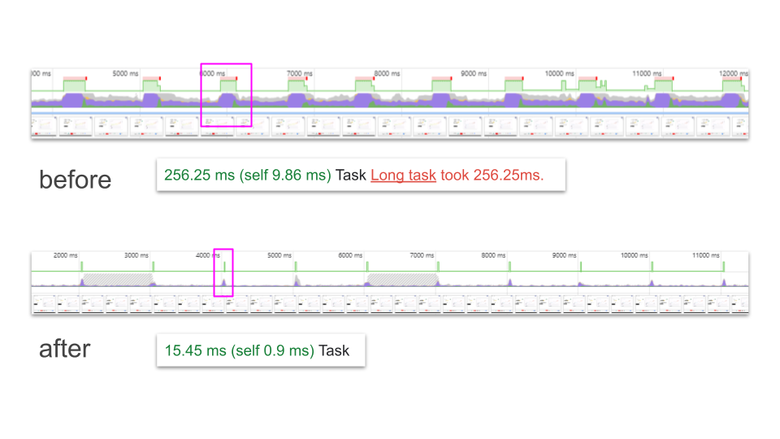

# Estimate CSS render costs

## Description

Get's estimations for a full page re-calculate styles, layout and paint. 

Changing the zoom level of the page causes recalculations of styles. 
When running the script multiple times in a row while recording in the performance tab,
you can and get rough estimations about the different parts of the DOM.

## Usage

1. Start the recording in the performance tab
2. Execute the script over one of the given options
3. Stop the recording and analyze the flames

You can use it as a base measurement to compare against global CSS improvements.

## How to use it

General usage description for all supported techniques can be found in the following table.

| Technique   | Is Usable  |
| ----------- | ---------- |
| [Bookmark](https://github.com/push-based/web-performance-tools/blob/master/docs/how-to-use-it-with-bookmarks)         |      ✔    | 
| [Console Tab](https://github.com/push-based/web-performance-tools/blob/master/docs/how-to-use-it-with-console-tab.md) |      ✔    | 
| [Sources Tab](https://github.com/push-based/web-performance-tools/blob/master/docs/how-to-use-it-with-sources-tab.md) |      ✔    | 
| [Chromium](https://github.com/push-based/web-performance-tools/blob/master/docs/how-to-use-it-with-chromium.md)       |      ✔    | 

# Credits

Author: _Michael Hladky - push-based.io_  
Source: _[github.com/push-based/web-performance-tools](www.github.com/push-based/web-performance-tools)_  
